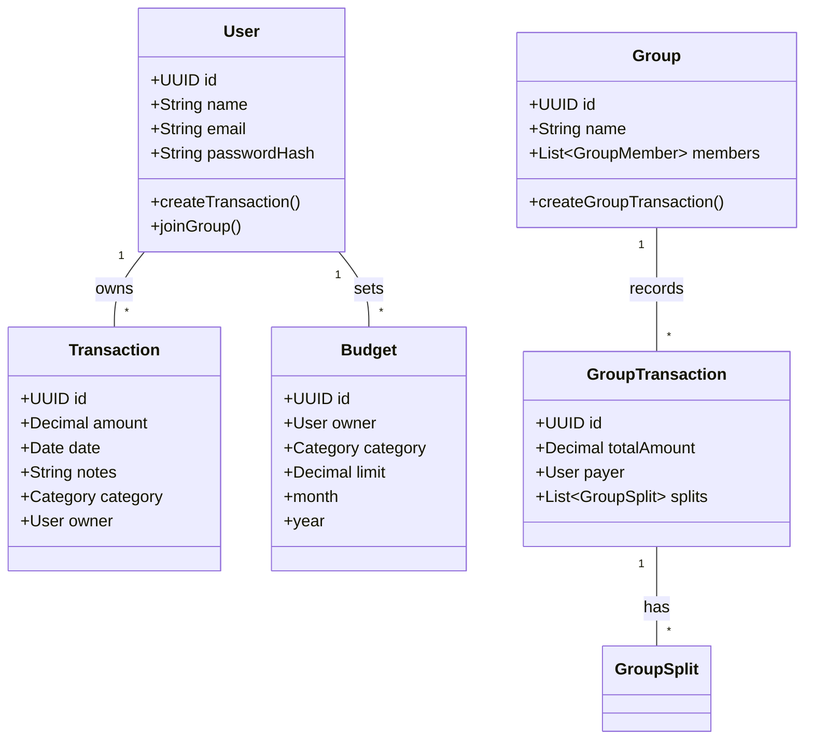
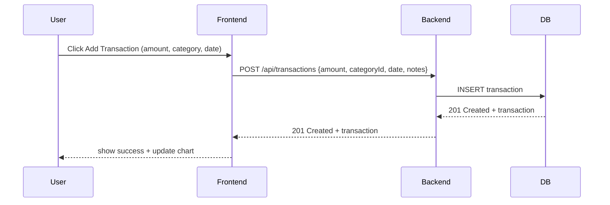
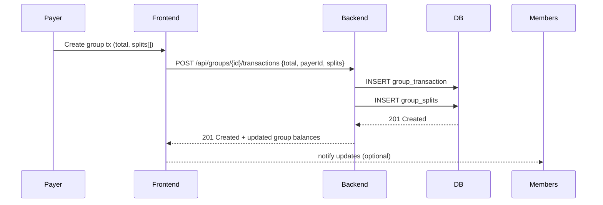
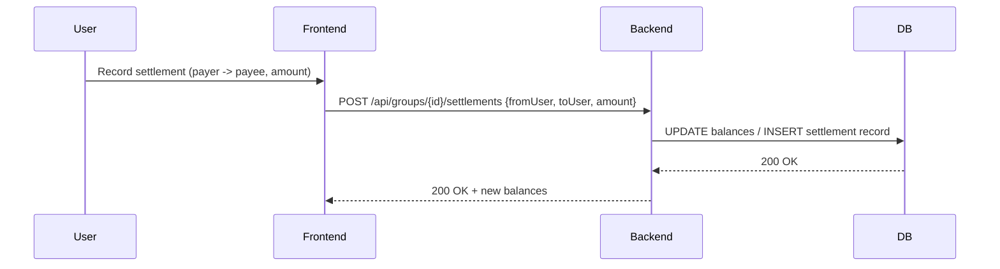

# Personal Budget Tracker

> Comprehensive Personal & Group Expense Management App

---

## Table of Contents

1. Project Overview
2. Features
3. Recommended tech Stack
4. Project Structure
5. Database ER Diagram 
6. System UML (Class & Component) Diagrams 
7. Key Sequence Diagrams 
8. API Reference (endpoints, payloads, responses)

---

## 1 — Project Overview

Personal Budget Tracker helps individuals and groups log transactions, set category budgets, visualize spending, and manage shared group expenses with automated balance calculations and settlements.

---

## 2 — Key Features

- Transaction management (CRUD for income/expense)
- Category budgets with monthly targets and alerts
- Personal dashboard: income vs expense, monthly summary, savings
- Charts: category breakdown, trend lines, budget progress
- Group expense management with equal/unequal splits
- Settlement recording to reconcile group balances
- Export/Import CSV & JSON

---

## 3 — Recommended Tech Stack

- Frontend: HTML, CSS, JS 
- Backend: Node.js (Express)&#x20;
- Database: MongoDB
- Charts: Chart.js
- Auth: JWT (server-side)&#x20;

---

## 4 — Suggested Project Structure

```
financeflow-backend/
├─ package.json
├─ .env.example
├─ README.md
├─ server.js
├─ config/
│   └─ db.js
├─ models/
│   ├─ User.js
│   ├─ Transaction.js
│   ├─ Budget.js
│   └─ Group.js
├─ routes/
│   ├─ auth.js
│   ├─ transactions.js
│   ├─ budgets.js
│   └─ groups.js
├─ middleware/
│   └─ auth.js
└─ public/
   ├─ index.html        
   └─ js/
       └─ backend-sync.js  

```

---

## 5 — Database ER Diagram

```mermaid
erDiagram
    USERS ||--o{ TRANSACTIONS : owns
    USERS ||--o{ GROUPS : member_of
    GROUPS ||--o{ GROUP_TRANSACTIONS : records
    GROUPS ||--o{ GROUP_MEMBERS : has
    CATEGORIES ||--o{ TRANSACTIONS : categorizes
    USERS ||--o{ BUDGETS : sets
    CATEGORIES ||--o{ BUDGETS : belongs_to

    USERS {
        uuid id PK
        string name
        string email
        string password_hash
        datetime created_at
    }
    CATEGORIES {
        uuid id PK
        string name
        string color
    }
    TRANSACTIONS {
        uuid id PK
        decimal amount
        enum type (income, expense)
        date date
        string notes
        uuid user_id FK
        uuid category_id FK
        uuid group_transaction_id FK NULL
    }
    GROUPS {
        uuid id PK
        string name
        uuid owner_id FK
        string description
    }
    GROUP_MEMBERS {
        uuid id PK
        uuid group_id FK
        uuid user_id FK
        decimal balance DEFAULT 0
    }
    GROUP_TRANSACTIONS {
        uuid id PK
        decimal total_amount
        date date
        string notes
        uuid group_id FK
        uuid payer_id FK  -- who paid
    }
    GROUP_SPLITS {
        uuid id PK
        uuid group_transaction_id FK
        uuid user_id FK
        decimal share_amount
    }
    BUDGETS {
        uuid id PK
        uuid user_id FK
        uuid category_id FK
        integer month  -- 1..12
        integer year
        decimal limit_amount
    }
```

---

## 6 — System UML Diagrams

### Class Diagram (Mermaid)



---

## 7 — Key Sequence Diagrams

### 7.1 Add Transaction (Personal)



### 7.2 Create Group Expense & Split (Unequal)



### 7.3 Record Settlement



---

## 8 — API Reference

> Base URL: `https://api.yourdomain.com` or `http://localhost:4000` (dev)

### Transactions

- `GET /api/transactions?from=YYYY-MM-DD&to=YYYY-MM-DD&category=catId&type=expense|income`

  - Response: `200 { transactions: [...] }`

- `POST /api/transactions` (protected)

  - Body:
    ```json
    {
      "amount": 1200.50,
      "type": "expense",
      "categoryId": "<uuid>",
      "date": "2025-09-14",
      "notes": "Lunch",
      "groupTransactionId": null
    }
    ```
  - Response: \`201 { transaction }

- `PUT /api/transactions/:id` (protected)

  - Body: fields to update
  - Response: `200 { transaction }`

- `DELETE /api/transactions/:id` (protected)

  - Response: `204 No Content`

### Categories

- `GET /api/categories`
- `POST /api/categories` (admin/user-defined)
- `PUT /api/categories/:id`
- `DELETE /api/categories/:id`

### Budgets

- `GET /api/budgets?month=9&year=2025` -> `200 { budgets: [...] }`
- `POST /api/budgets` -> create / update user category budget
  - Body: `{ userId?, categoryId, month, year, limitAmount }`
  - Response: `201 { budget }`

### Groups & Group Transactions

- `POST /api/groups` -> create a group

  - Body: `{ name, ownerId, members: [userId1, userId2, ...] }`
  - Response: \`201 { group }

- `GET /api/groups/:id/balances` -> get computed balances per member

- `POST /api/groups/:id/transactions` -> add a group-level transaction

  - Body example (unequal split):
    ```json
    {
      "totalAmount": 5000,
      "payerId": "uuid-of-payer",
      "splits": [
        { "userId": "u1", "amount": 2000 },
        { "userId": "u2", "amount": 1500 },
        { "userId": "u3", "amount": 1500 }
      ],
      "notes": "Trip dinner"
    }
    ```
  - Response: `201 { groupTransaction }`

- `POST /api/groups/:id/settlements` -> record a settlement between members

  - Body: `{ fromUserId, toUserId, amount }`
  - Response: \`200 { settlementRecord }

### Reports / Exports

- `GET /api/reports/monthly?month=9&year=2025` -> returns aggregated sums and percentages
- `GET /api/export/csv?from=...&to=...` -> CSV file download

---
